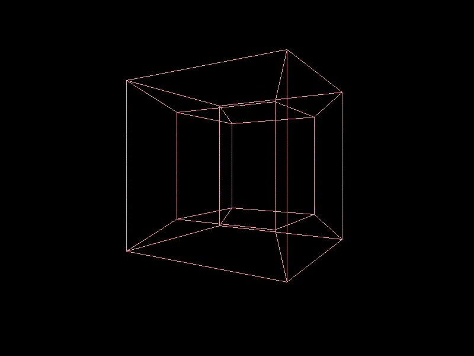

# 4D in Rust

A simple exercise in 4D shapes rendering.




# Quick Start

Install [Rust](https://www.rust-lang.org/) first.

```console
$ cargo run
```

# References

- http://kennycason.com/posts/2009-01-08-graph4d-rotation4d-project-to-2d.html
- https://gist.github.com/krazkidd/b8bf11892e243e98c096
